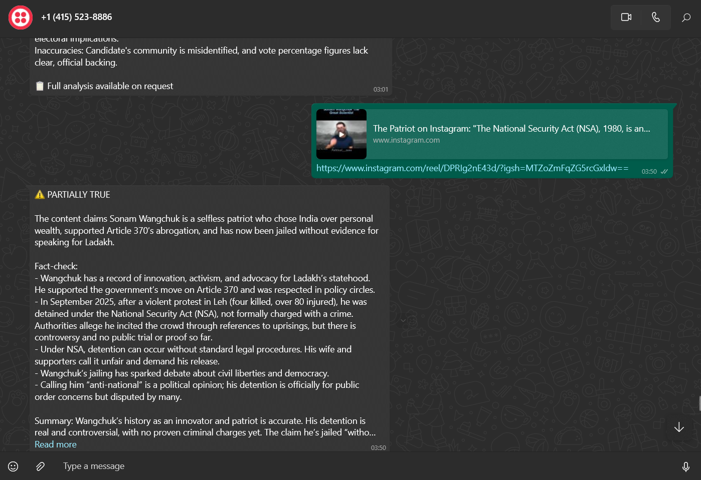
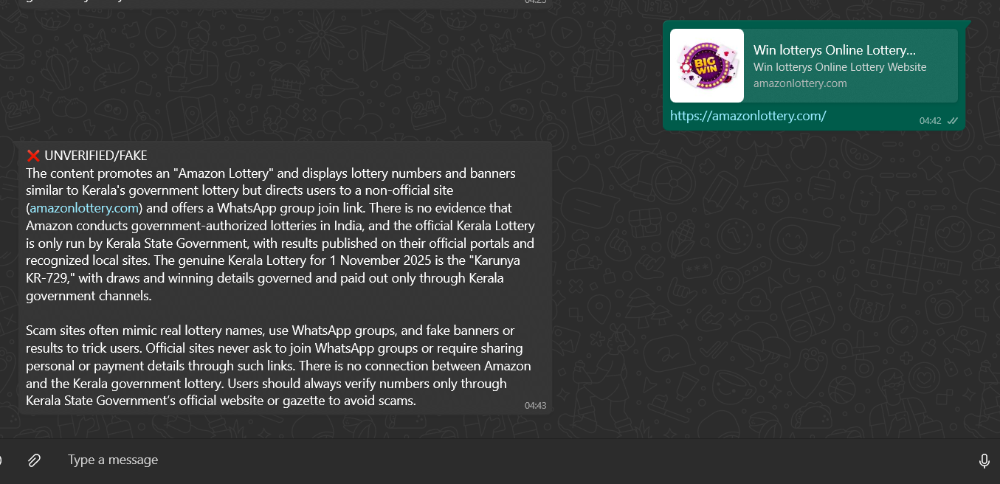
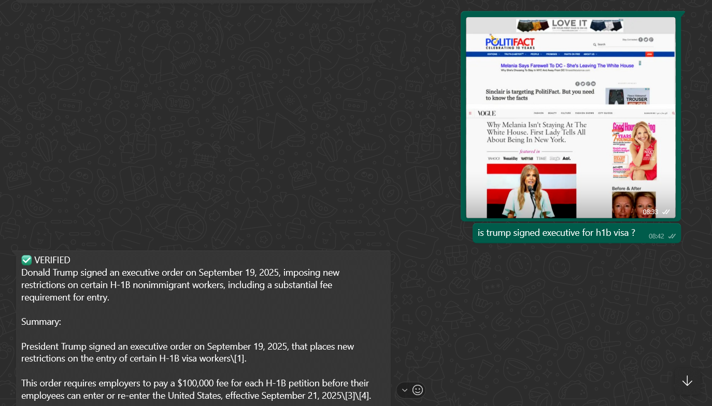

# 🛡️ AI Fact-Checker WhatsApp Bot

An intelligent WhatsApp bot that fact-checks messages, URLs, images, and audio using advanced AI technologies. Built with Google Cloud services and Perplexity AI for accurate, real-time fact verification.

## 🚀 Features

- **Multi-Format Input Support**: Text, Audio, Images, and URLs
- **AI-Powered Fact Checking**: Uses Perplexity AI for comprehensive analysis
- **OCR Text Extraction**: Google Cloud Vision API for image text recognition
- **Speech-to-Text**: Google Cloud Speech API for audio transcription
- **Multi-Language Support**: Automatically translates responses to English
- **URL Analysis**: Extracts and analyzes content from Instagram, YouTube, and web URLs
- **Real-time WhatsApp Integration**: Instant responses via Twilio

## 🏗️ Tech Stack

### Core Technologies
- **Node.js** - Runtime environment
- **Express.js** - Web framework
- **Twilio** - WhatsApp Business API integration

### AI & Machine Learning
- **Perplexity AI** - Advanced fact-checking and content analysis
- **Google Cloud Speech-to-Text** - Audio transcription
- **Google Cloud Vision API** - OCR and image text extraction

### Additional Services
- **Custom Fact-Check API** - URL content extraction and analysis
- **Axios** - HTTP client for API requests

## 📱 How to Connect to WhatsApp

### Step 1: Add Bot Number
Add this number to your WhatsApp: **+1 (415) 523-8886**

### Step 2: Join the Service
Send this code to connect: **`join basket-subject`**

### Step 3: Start Using!
Once connected, you can send:
- 📝 Text messages for fact-checking
- 🎤 Voice messages for audio analysis
- 📷 Images with text for OCR analysis
- 🔗 URLs from Instagram, YouTube, or websites

## 🖼️ Usage Examples

### Instagram Post Analysis

*Send an Instagram URL to get fact-checked content analysis*

### Suspicious Link Verification
 
*Verify suspicious lottery or scam links for authenticity*

### Image Text Analysis

*Upload images with text for fake news detection*

## 🛠️ Setup & Installation

### Prerequisites
- Node.js (v14 or higher)
- Google Cloud Platform account
- Twilio account
- Perplexity AI API key

### Installation Steps

1. **Clone the repository**
```bash
git clone https://github.com/NerdNinzas/fact-check-bot.git
cd fact-check-bot
```

2. **Install dependencies**
```bash
npm install
```

3. **Set up Google Cloud credentials**
```bash
# Create a service account key in Google Cloud Console
# Download the JSON key file
export GOOGLE_APPLICATION_CREDENTIALS="path/to/your/service-account-key.json"
```

4. **Configure environment variables**
Create a `.env` file:
```env
# Twilio Configuration
TWILIO_ACCOUNT_SID=your_account_sid
TWILIO_AUTH_TOKEN=your_auth_token

# Perplexity AI
PERPLEXITY_API_KEY=your_perplexity_key

# Google Cloud (if not using GOOGLE_APPLICATION_CREDENTIALS)
GOOGLE_PROJECT_ID=your_project_id

# Server Configuration
PORT=3000
PUBLIC_URL=https://your-ngrok-url.ngrok.app
```

5. **Start the server**
```bash
npm start
```

## 🔧 API Endpoints

### Main Webhook
- **POST** `/whatsapp` - Handles WhatsApp messages

### Test Endpoints
- **GET** `/test` - Server health check
- **POST** `/test-webhook` - Test Twilio webhook
- **POST** `/test-simple` - Simple message test

## 📋 Supported Input Types

### 1. Text Messages
Direct text fact-checking with AI analysis
- Example: "Is climate change real?"
- Response: Verified facts with sources

### 2. Audio Messages
Voice message transcription and analysis
- Supports multiple languages (Hindi, English, Spanish, etc.)
- Automatic translation to English responses

### 3. Image Analysis
OCR text extraction and fact verification
- Scans text from images
- Detects fake news in screenshots
- Analyzes memes and social media posts

### 4. URL Analysis
Content extraction and verification
- Instagram posts
- YouTube videos
- Website articles
- Suspicious links and scams

## 🔒 Security Features

- **Input Sanitization**: All inputs are cleaned and validated
- **Rate Limiting**: Prevents spam and abuse
- **Error Handling**: Graceful failure with user-friendly messages
- **Privacy**: No data storage, real-time processing only

## 🌍 Multi-Language Support

The bot automatically:
- Detects input language (Hindi, Spanish, French, etc.)
- Processes content in original language
- Responds in clear English
- Maintains context and accuracy

## 📊 Response Format

All fact-check responses include:
- **Status Indicator**: ✅ VERIFIED, ❌ UNVERIFIED/FAKE, ⚠️ PARTIALLY TRUE
- **Detailed Analysis**: Evidence-based explanation
- **Sources**: Referenced fact-checking information
- **Character Limit**: Optimized for WhatsApp (1500 chars max)

## 🚀 Deployment

### Using ngrok (Development)
```bash
# Install ngrok
npm install -g ngrok

# Start your server
npm start

# In another terminal, expose port 3000
ngrok http 3000

# Use the HTTPS URL in your Twilio webhook configuration
```

### Production Deployment
Deploy to platforms like:
- **Heroku**: `git push heroku main`
- **Railway**: Connect GitHub repository
- **Google Cloud Run**: Use provided Dockerfile
- **AWS EC2**: Traditional server setup

## 🔍 Monitoring & Logging

The bot includes comprehensive logging:
- Request/response tracking
- Error monitoring
- Performance metrics
- API usage statistics

Check console logs for:
- Successful fact-checks: ✅
- Processing errors: ❌
- API responses: 📡
- Message delivery: 📤

## 🤝 Contributing

1. Fork the repository
2. Create a feature branch
3. Make your changes
4. Add tests if applicable
5. Submit a pull request

## 📄 License

This project is licensed under the ISC License - see the LICENSE file for details.

## 🆘 Support & Issues

- **GitHub Issues**: Report bugs and request features
- **Documentation**: Check this README for setup help
- **Community**: Join our Discord for support

## 🙏 Acknowledgments

- **Google Cloud Platform** - Speech and Vision APIs
- **Perplexity AI** - Advanced fact-checking capabilities
- **Twilio** - WhatsApp Business API integration
- **OpenAI** - AI model inspiration and guidance

---

**Made with ❤️ by NerdNinzas**

*Fighting misinformation, one message at a time.*